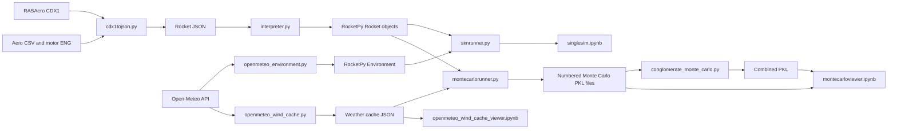

# Project Blaze RocketPy simulation tools

This directory contains the tools used to convert rocket designs, construct
RocketPy objects, build atmospheric models, run single or Monte Carlo flights,
and analyze the results.

> Use the scripts directly in `rocketpy/` as the canonical versions. Folders
> such as `Chunc_Sims`, `ONC_sims`, `lijah simmy`, and
> `monte carlo portable version 1` contain project-specific copies or snapshots
> that may not include later changes.

## System workflow



## File summary

| File | Purpose | Primary inputs | Primary outputs |
| --- | --- | --- | --- |
| [`cdx1tojson.py`](cdx1tojson.py) | Convert RASAero data into the project rocket schema | `.CDX1`, aerodynamic CSV, RASP `.eng` | Version 1 or version 2 rocket JSON |
| [`cdx1_summary_png.py`](../Flight%20Sims/cdx1_summary_png.py) | Render a dimension, mass and saved-results reference sheet | One or more `.CDX1` files | A labeled PNG beside each input |
| [`interpreter.py`](interpreter.py) | Construct RocketPy rocket and motor objects | Rocket JSON and referenced assets | `Rocket` and readiness diagnostics |
| [`openmeteo_environment.py`](openmeteo_environment.py) | Build one atmosphere from Open-Meteo | Location, local date/time and model settings | RocketPy `Environment` and profile arrays |
| [`openmeteo_wind_cache.py`](openmeteo_wind_cache.py) | Download a reusable weather ensemble | Monte Carlo configuration JSON | Wind-cache JSON and partial checkpoint |
| [`simrunner.py`](simrunner.py) | Run single-stage and staged flights | Rocket object(s), Environment and launch settings | `Flight`, solution list or `FullStackSimulationResult` |
| [`montecarlorunner.py`](montecarlorunner.py) | Sample parameters and run simulations in parallel | Monte Carlo config, rocket JSON and weather | Numbered streamed pickle |
| [`conglomerate_monte_carlo.py`](conglomerate_monte_carlo.py) | Combine Monte Carlo outputs | Pickle files, directories or globs | Combined streamed pickle |
| [`singlesim.ipynb`](singlesim.ipynb) | Inspect rockets and run individual flights | Rocket JSON and weather settings | Interactive diagnostics and plots |
| [`montecarloviewer.ipynb`](montecarloviewer.ipynb) | Analyze Monte Carlo results | Runner or combined pickle | Statistics, plots, PDF, PNG, CSV and KML |
| [`openmeteo_wind_cache_viewer.ipynb`](openmeteo_wind_cache_viewer.ipynb) | Inspect the cached weather ensemble | Monte Carlo config and wind cache | Profile and distribution plots |

## cdx1tojson.py

### Purpose

Converts a RASAero II design into the `rocketpy-cdx1` JSON format consumed by
`interpreter.py`. It:

- Converts RASAero imperial values to SI units.
- Extracts nose, body, transition, booster and fin geometry.
- Imports recovery events.
- Approximates dry moments of inertia as a uniform cylinder.
- Imports aerodynamic and motor curves.
- Produces separate full-stack and sustainer definitions when a booster is
  present.

### Inputs

- A required RASAero `.CDX1` file.
- One aerodynamic CSV for a single-stage rocket, or separate full-stack and
  sustainer aerodynamic CSV files for a staged rocket.
- An optional standalone-booster aerodynamic CSV.
- RASP `.eng` thrust curves supplied separately or through a multi-motor
  library.
- An optional output path. Without one, the input name is reused with a
  `.json` suffix.

The aerodynamic CSV must contain Mach-indexed power-on and power-off drag
columns. Paths written into the JSON are made relative to the output JSON.

### Output

A version 1 JSON contains one `rocket` and `stages` definition. A design with
a booster produces version 2 JSON with selectable `full_stack` and `sustainer`
definitions. A standalone `booster` is included only when its aerodynamic
curve is supplied.

```powershell
python .\cdx1tojson.py design.CDX1 rocket.json `
  --full-stack-aero full_stack.csv `
  --sustainer-aero sustainer.csv `
  --booster-thrust booster.eng `
  --sustainer-thrust sustainer.eng
```

`--booster-thrust` powers the attached full stack. It is not attached to the
standalone booster object.

## cdx1_summary_png.py and cdx1_summary_png.bat

### Purpose

Creates a single PNG reference sheet directly from a RASAero file. The sheet
contains a labeled side profile, component dimensions, fin geometry, launch
masses, centers of gravity, motor names, launch-site settings, recovery events,
and any nonzero simulation results saved in the CDX1 file. Dimensions are shown
in inches, masses in pounds, and other values in RASAero's native imperial units.

For Windows Explorer use, drag one or more `.CDX1` files onto
[`cdx1_summary_png.bat`](../Flight%20Sims/cdx1_summary_png.bat). Each output is written beside its source as
`<design name>_summary_YYYYMMDD_HHMMSS.png` and opened automatically. The launcher prefers the
workspace virtual environment and falls back to the installed Python launcher.

The Python script can also be called directly:

```powershell
python ".\Flight Sims\cdx1_summary_png.py" design.CDX1
python ".\Flight Sims\cdx1_summary_png.py" design.CDX1 --output dimensions.png --dpi 220
```

## interpreter.py

### Purpose

Reads `rocketpy-cdx1` JSON and constructs a RocketPy `Rocket`. It selects the
requested configuration, resolves asset paths relative to the JSON, reads
embedded or external aerodynamic data, creates the motor, adds external
geometry and aerodynamic surfaces, and adds enabled parachutes. Parachute
`CdA` is calculated from the configured diameter and drag coefficient.

Rail buttons and enabled parachutes are optional. A rocket without parachutes
can be simulated ballistically.

### Library interface

```python
rocket = load_rocket(
    "rocket.json",
    rocket_key="full_stack",
    require_simulation_ready=True,
)
```

- `rocket_key` may select `full_stack`, `sustainer`, or `booster` from a
  version 2 file.
- Without a key, the JSON `default_rocket` is used.
- `require_simulation_ready=True` rejects incomplete simulation data.

The returned RocketPy object also has `source_configuration` and
`simulation_readiness_issues` attributes.

### CLI

```powershell
python .\interpreter.py rocket.json --rocket full_stack --strict
```

The CLI prints the constructed rocket name and readiness issues. It does not
run a flight or write another file.

## openmeteo_environment.py

### Purpose

Fetches Open-Meteo pressure-level data and converts it into a RocketPy custom
atmosphere. It builds pressure, temperature, east-wind and north-wind profiles.
For high-altitude flights, pressure and temperature can be extended above the
weather model using a matched ISA profile while the top wind is held constant.

### Inputs

- Latitude and longitude.
- Local date and hour.
- IANA timezone.
- Optional elevation.
- Model and `auto`, `forecast`, or `historical` endpoint.
- Maximum expected altitude.
- Whether to extend above the Open-Meteo model top.

### Output

`create_openmeteo_environment(...)` returns `OpenMeteoEnvironmentResult`,
containing:

- A RocketPy `Environment`.
- Pressure, temperature, east-wind and north-wind arrays.
- The original model-top altitude.
- The request URL and raw API response.

```powershell
python .\openmeteo_environment.py `
  --latitude 40.870683 --longitude -119.10695 `
  --date 2026-09-26 --time 12:00 `
  --timezone America/Los_Angeles `
  --elevation-m 1191 --max-expected-height-m 180000 --info
```

## openmeteo_wind_cache.py

### Purpose

Downloads the set of weather profiles required by a Monte Carlo ensemble.
Using a cache prevents every simulation launch from making an API request and
makes a weather ensemble repeatable. The script spaces requests, retries rate
limits, validates the forecast horizon and resumes compatible partial runs.

### Input

A version 1 Monte Carlo configuration. The script reads the `environment` and
`environment.wind_sampling` sections, including:

- `cache_file`
- `calls_per_day`
- `days_either_side`
- `request_interval_seconds`
- `rate_limit_retry_wait_seconds`
- `max_retries`

`--output` overrides the configured cache path.

### Outputs

- A JSON file with format `projectblaze.openmeteo.wind_profiles`.
- A `.partial` checkpoint while downloading. It is removed after the final
  cache is successfully written.
- `load_cached_environment_provider(path)`, used by `montecarlorunner.py`.

```powershell
python .\openmeteo_wind_cache.py .\montecarlo_config.json
```

Run this before the Monte Carlo runner when cached wind sampling is enabled.

## simrunner.py

This is an importable library and has no standalone CLI.

### run_single_simulation

Accepts one `Rocket`, one `Environment`, rail length, inclination above the
horizontal, heading, maximum integrator step and solver tolerances. It returns
a RocketPy `Flight`.

The returned flight's quaternion states are normalized to prevent numerical
drift from causing invalid Euler-angle values in `Flight.info()`.

### runfullstacksim

Accepts a full-stack rocket, sustainer rocket, environment and overall time
limit. Optional arguments control coast time, rail length, rod angle away from
vertical, heading, solver settings and the maximum permitted ignition tilt.

The phases are:

1. Full-stack boost through booster burnout.
2. Booster separation at burnout.
3. Unpowered sustainer coast for `coast_period`.
4. Sustainer tilt check.
5. Powered sustainer flight, or unpowered recovery when ignition is locked out.

Sustainer timestamps are shifted onto the original launch-time axis so the
phases line up in comparison plots.

- `return_details=False` returns the combined solution list.
- `return_details=True` returns `FullStackSimulationResult`, containing the
  solution, phase `Flight` objects, staging tilt, ignition time, whether the
  sustainer ignited, and the lockout state.

## montecarlorunner.py

### Purpose

Samples simulation parameters, runs flights in parallel processes and writes
complete numerical histories without pickling live RocketPy objects. A
`full_stack` plus `sustainer` pair is recognized as one staged vehicle. Other
rockets are simulated independently.

### CLI input

```powershell
python .\montecarlorunner.py .\montecarlo_config.json
python .\montecarlorunner.py .\montecarlo_config.json --validate-only
```

Paths in the configuration are resolved relative to the configuration file.
`--validate-only` checks the rocket selection and parameter plan without
fetching weather or running flights.

### Parameter distributions

Each supported entry under `simulation.parameters` can be:

- A number for a fixed value.
- `{"distribution":"fixed","value":...}`.
- A normal distribution with `mean` and `std`, optionally bounded by `min`
  and `max`.
- A deterministic sweep with `min` and `max`. Values are evenly spaced by
  simulation index and include both endpoints when more than one simulation
  is requested.

Supported parameters include launch angle, heading, rail length, time limits,
solver tolerances, coast period, ignition tilt limit, stage impulse ratio,
stage mass ratio, booster wet mass and sustainer wet mass.

### Parallel execution and storage

- `workers` sets the number of spawned simulation processes.
- `native_threads_per_worker` limits nested numerical-library threads.
- Workers use private rocket copies.
- Each completed simulation is first written to a disk shard, keeping parent
  memory approximately bounded as the batch progresses.

### Output

The configured output stem receives a random 12-digit suffix, for example
`monte_carlo_flights_083417295106.pkl`. The streamed pickle begins with a
metadata dictionary followed by one record per flight. Records contain the
14-state trajectory, launch inputs, flight summary, weather sample and staged
flight metadata where applicable.

Use `load_monte_carlo_output(path)` instead of loading the pickle directly.
The loader also applies simulation-index offsets in conglomerated files.

> An integer `random_seed` makes repeated runs reproducible. Different
> numbered files can therefore contain identical samples. Set `random_seed`
> to `null` when repeated runs should generate independent cases.

## conglomerate_monte_carlo.py

### Purpose

Combines compatible Monte Carlo outputs into one file. Inputs can be explicit
pickle files, directories, or glob expressions. It verifies the project
format, state columns and environment metadata.

```powershell
python .\conglomerate_monte_carlo.py `
  -o .\combined_flights.pkl `
  ".\monte_carlo_flights_*.pkl"
```

The combined output is another streamed pickle accepted by
`load_monte_carlo_output` and `montecarloviewer.ipynb`. Existing streamed
records are copied as buffered bytes rather than decoded and re-encoded, so
large merges run near disk-copy speed without loading every trajectory into
RAM. The header stores source files, record counts and simulation-index
offsets.

Only load or combine pickle files you trust. Python pickle data can execute
code when opened.

## singlesim.ipynb

Interactive validation before running a large batch. The notebook:

- Locates the canonical Python modules.
- Builds an Open-Meteo environment.
- Loads a rocket JSON.
- Displays rocket and motor information.
- Runs `run_single_simulation` and displays the flight and trajectory.
- Loads `full_stack` and `sustainer` definitions for a staged simulation.
- Runs `runfullstacksim` with a configurable coast period.

Edit `JSON_PATH`, weather time, launch settings, coast period and time limit in
the notebook. Results remain notebook output unless explicitly saved.

## montecarloviewer.ipynb

Loads a runner or combined pickle through `load_monte_carlo_output`, converts
the records into NumPy and pandas structures, and produces:

- Summary statistics and stage-ratio sanity checks.
- Frequency plots for altitude, ignition angle, maximum velocity, launch
  inclination and heading.
- Flight envelopes and trajectory analysis.
- PNG and PDF reports.
- A CSV percentile flight profile.
- KML paths, landing points and landing dispersion for Google Earth.

Set `PKL_PATH`, histogram bins, tilt-lockout filters, report resolution,
profile percentile and resampling interval in the configuration cells. Files
are written under `monte_carlo_viewer_outputs/` in a timestamped directory.

## openmeteo_wind_cache_viewer.ipynb

Validates and visualizes the cached weather ensemble. It follows the
`environment.wind_sampling.cache_file` setting in `montecarlo_config.json`,
interpolates profiles onto a common altitude grid, and calculates wind speed
and direction.

Inputs include the cache path, altitude step, optional maximum altitude,
speed-bin count and direction-bin width. Outputs include the profile inventory,
overlaid wind profiles, altitude-conditioned relative-frequency plots and
distribution summaries.

## Data formats

### Rocket JSON

The format marker is `rocketpy-cdx1`. Version 1 stores one rocket. Version 2
stores named rocket definitions plus `default_rocket`. Values use metres,
kilograms and seconds. Aerodynamic and thrust data may be embedded or
referenced relative to the JSON directory.

### Monte Carlo configuration JSON

The format marker is `projectblaze.rocketpy.monte_carlo_config`, version 1.
Its main sections are:

- `rocket_json`, `rockets`, and `allow_incomplete_rocket`.
- `environment` for location, time, weather model and maximum altitude.
- `environment.wind_sampling` for ensemble and cache settings.
- `simulation` for case count, workers, random seed, output stem and parameter
  distributions.

### Aerodynamic CSV and RASP ENG

Aerodynamic CSV files provide Mach-indexed power-on and power-off drag. RASP
`.eng` files provide motor metadata and time-thrust samples. The converter can
embed both datasets in the rocket JSON.

### Monte Carlo pickle

The streamed binary format contains one metadata dictionary followed by one
dictionary per flight. It is designed for bounded-memory writing and fast
concatenation. Use the project loader for normal and combined files.

## Recommended workflows

### Validate one rocket

1. Convert a CDX1 file or prepare a compatible rocket JSON.
2. Run `interpreter.py --strict` to find missing simulation data.
3. Select the JSON in `singlesim.ipynb` and inspect the rocket.
4. Run a flight and review stability, trajectory, motor placement and recovery.

### Run a Monte Carlo batch

1. Prepare `montecarlo_config.json`.
2. Run `montecarlorunner.py ... --validate-only`.
3. If wind sampling is enabled, run `openmeteo_wind_cache.py`.
4. Run `montecarlorunner.py` and note the numbered pickle path.
5. Select that pickle in `montecarloviewer.ipynb`.

### Accumulate multiple batches

1. Set `random_seed` to `null` for independent batches.
2. Run `montecarlorunner.py` repeatedly. Randomized filenames prevent
   overwrites.
3. Merge matching files with `conglomerate_monte_carlo.py`.
4. Load the combined pickle in `montecarloviewer.ipynb`.

## Maintenance

Modify the canonical modules under `rocketpy/` first. If a project folder or
portable bundle must remain standalone, deliberately copy and retest the
canonical changes there. Snapshot copies do not update automatically.
